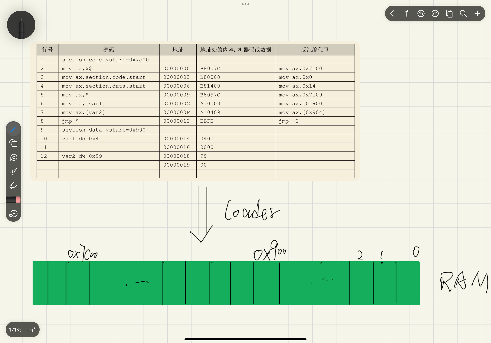

# section
*section*是编译器提供给程序员的伪指令，是为了让程序员在逻辑上把程序分为几个部分。例如`section data`声明了一个data块，`section code`声明了一个代码块，`section.data.start`表示data块的起始地址。

---

# vstart

*vstart*用于声明一个节的起始地址，`section code vstart=0x7c00`声明了一个code节，并告诉加载器，在程序加载时把code节加载到内存的0x7c00位置处，**vstart只是告诉编译器以新的数字作为后面数据的起始地址，它本身并没有改变数据本身在文件中的地址，若改变地址，0x7c00之前的位置要用0来填充，导致文件太大了**

---

  
**可以看出源文件中的数据仍然是相对于文件开头的偏移**

