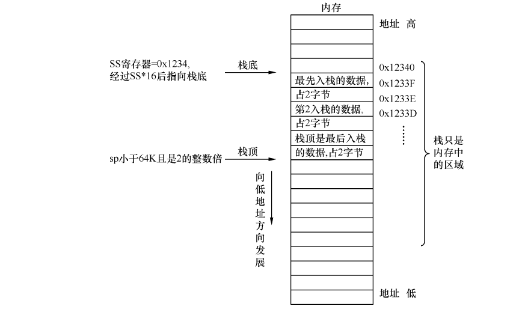

# 栈
**栈**是一种线性结构，在使用的过程中时向下扩展的，所以栈顶地址一定小于栈底地址，通过栈基址寄存器*SS*和栈指针寄存器*SP*来访问栈顶元素。  
  
1.**push**操作：SP-1，访问SS:SP并向该位置存入数据  
2.**pop**操作：弹出SS:SP处的元素，再SP+1

---

# 实模式下的ret
**ret**指令的功能是在栈顶弹出两个字节的内容来替换IP寄存器的内容  
**retf**是从栈顶弹出*4*字节来替换IP和CS的内容

