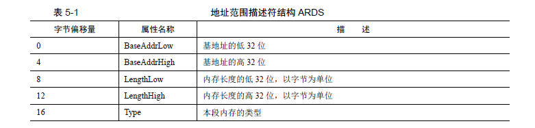
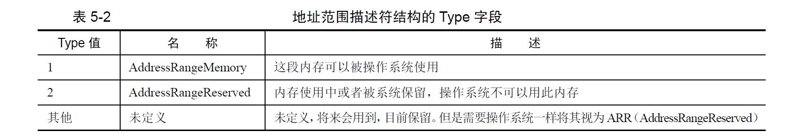

# 获取物理内存容量
实现方法：通过调用bios的*0x15*中断的三个子功能实现实现,子功能号存放在eax或者ax中   
- eax=0xe820,遍历主机所有内存
- ex=0xe801,分别检测低15M和16M—4G的内存，最大支持4G
- ah=0x88,最大支持64M内存检测，超过64M按照64返回
## 利用0xe820获取内存
*0xe821*能够获取系统的内存布局，由于系统内存各部分的类型属性不同，BIOS就按照**类型
属性**来划分这片系统内存，所以这种查询呈迭代式，每次**BIOS只返回一种类型的内存信息**，直到将所有内存类型返回完毕。返回的信息叫做地址范围描述符（ARDS）  
  
***ARDS***:此结构中的字段大小都**4**字节，**5**个字段,所以此结构大小**20**字节   
***TYPE字段***：用来描述这段内存的类型，这里所谓的类型是说明这段内存的用途，即其是可以被操作系统使用，还是保留起来不能用   

**0xe821的输入**：
- eax中存放0x15号中断的功能号0xe821
- ebx中存放的是ARDS的后续值，用来指示返回哪种类型的ARDS
- es:di表示ards的缓冲区，bios将获取到的内存信息存放到es:di指向的内存
- ecx表示ards结构的大小
- edx固定为签名标记0x534d4150，此数字是字符串SMAP的ascii码，用此签名校验es:di中存放的内存信息
**输出**
- cf位为0时，表示调用未出错，cf位为1时，表示调用出错
- es:di中存放bios输出的信息
- ards结构的大小
- ebx在cf位为0的情况下，ebx也为0表示已经是ards的最后一个结构

## 0xe801号子功能获取内存
**0xe801**最大能识别4G内存，低于15M的以1KB为单位记录在ax和cx中，ax和cx中的数值是一样的，16M-4G是以64KB为单位进行记录的，单位数量记录在bx和dx中。  

**0xe801的输入**
- eax存放子功能号0xe801
**输出**
- cf为0时表示调用未出错，cf为1时，表示调用出错
- ax只显示15M以下的内存容量
- bx显示高于15M的内存容量