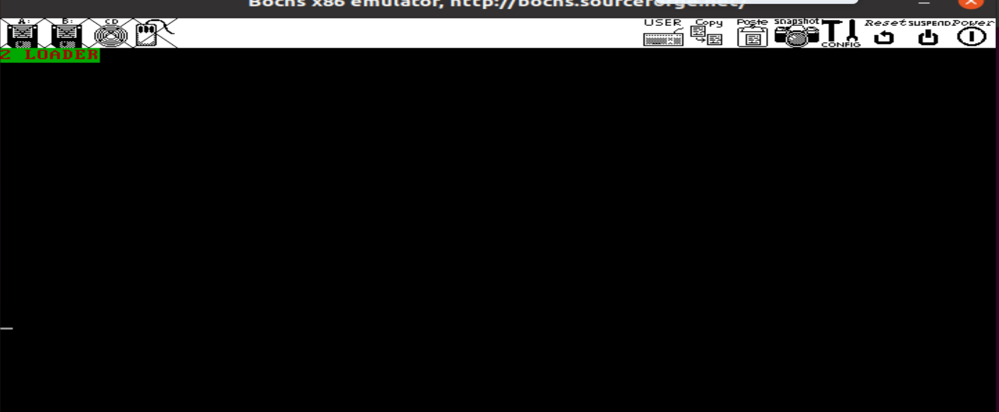

1.编译MBR.S文件，'nasm -I include/ -o mbr.bin MBR.S',-I表示引用的库目录，include文件夹下有boot.inc   
2.编译loader.S文件，'nasm -I include/ -o loader.bin loader.S'  
3.使用dd命令将mbr.bin和loader.bin写入硬盘，dd if=loader.bin of=hd40.img bs=512 seek=2 count=1 conv=notrunc   
4.启动bochs，./bochs -f bochsrc.disk    

  ---------------------
  
